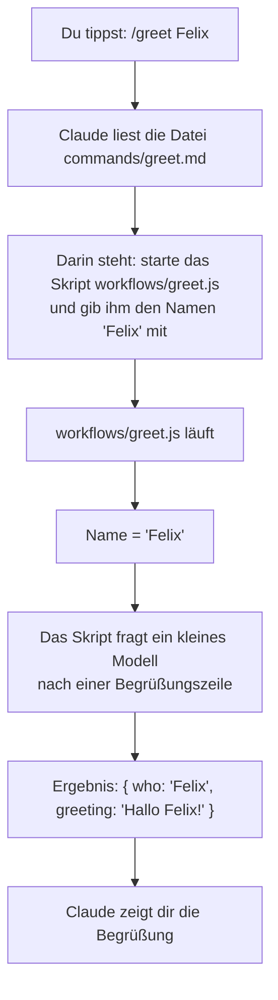

# Aufbau: wie die Teile zusammenarbeiten

Ein Plugin ist ein **Ordner voller Bausteine**. Jeder Baustein wird zu einem
bestimmten Moment gelesen oder ausgeführt. Das Schöne am `example`-Plugin: mehrere
Bausteine laufen in **eine** kleine Funktion zusammen — das Begrüßen (`greet`).

## Der Weg von `/greet Felix`

So läuft es Schritt für Schritt ab, wenn du `/greet Felix` tippst:

In Worten:

1. **`commands/greet.md`** ist kein Programm — es ist ein **Zettel mit einer
   Anweisung** an Claude: „Starte das Skript und gib den getippten Namen weiter."
2. Im Aufruf steht `${CLAUDE_PLUGIN_ROOT}`. Das ist ein **Platzhalter** für „der
   Ordner, in dem das Plugin installiert wurde". Dadurch findet Claude das Skript
   **egal wo** das Plugin liegt.
3. **`workflows/greet.js`** ist das eigentliche kleine Programm. Es nimmt den
   Namen, fragt ein **kleines, schnelles Modell** nach einer Begrüßung und **gibt
   ein Ergebnis zurück**: `{ who, greeting }`.
4. Claude zeigt dir die Begrüßung.

## Zwei Wege, ein Ziel

Es gibt **zwei** Wege, das Begrüßen zu starten — und beide landen im **gleichen**
Skript:

| Weg | Wer startet ihn? |
|-----|------------------|
| `/greet Felix` (Befehl) | **du** tippst ihn bewusst |
| Skill `run-greet` | **Claude** startet ihn von allein, wenn deine Anfrage passt |

Weil beide in dasselbe `greet.js` führen, gibt es den Code nur **einmal**. Das
nennt man **eine Quelle der Wahrheit** — man muss nichts doppelt pflegen.

## Hinweis zum Subagenten

Die Datei `agents/greeter.md` ist nur ein **Muster** ("so sieht eine Agent-Datei
aus"). Sie wird im `greet`-Ablauf **nicht** benutzt — nicht verwirren lassen.
